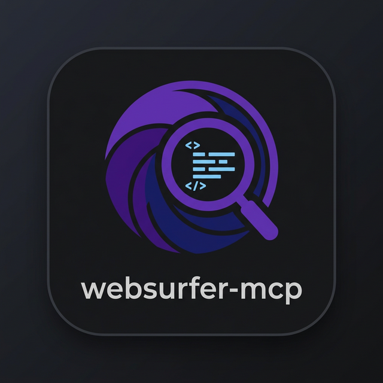

<p align="center">
  
</p>

<h1 align="center">WebSurfer MCP</h1>

<p align="center">
  <b>Securely fetch and extract clean text from the web for LLMs.</b><br/>
  <sub>MCP Server &bull; src-layout Python package &bull; SSRF Protection</sub>
</p>

<p align="center">
  
  
</p>

WebSurfer is a Model Context Protocol (MCP) server designed to provide Large Language Models (LLMs) with secure and efficient access to web content. The repository now uses a modern `src/websurfer_mcp` package layout with a dedicated CLI, deterministic tests, and repository-level tooling.

## Core Features

- **Advanced URL Validation**: Implements strict security controls using the `ipaddress` module to block access to private, loopback, and reserved IP ranges (SSRF protection).
- **Optimized Content Extraction**: Utilizes `trafilatura` and `BeautifulSoup4` to extract high-quality, readable text from HTML, effectively removing boilerplate such as navigation, headers, and scripts.
- **Resource Management**: Enforces strict content size limits and request timeouts to ensure system stability and performance.
- **Rate Limiting**: Built-in request throttling to prevent service abuse and manage resource consumption.
- **Robust Error Handling**: Provides granular feedback for network issues, HTTP errors, and content parsing failures.

## Project Layout

```text
websurfer-mcp/
├── src/websurfer_mcp/
│   ├── cli.py
│   ├── config.py
│   ├── extractor.py
│   ├── server.py
│   └── url_validation.py
├── tests/
├── docs/images/
├── pyproject.toml
└── run_tests.py
```

Key runtime components:

- `WebSurferServer`: MCP transport and tool registration.
- `TextExtractor`: asynchronous HTTP fetching and readable-text extraction.
- `URLValidator`: URL normalization and SSRF-focused validation.
- `Config`: environment-driven runtime configuration.

## Installation

### Prerequisites

- Python 3.12 or higher
- [uv](https://github.com/astral-sh/uv) package manager

### Setup

1. **Clone the repository**:
   ```bash
   git clone https://github.com/crybo-rybo/websurfer-mcp
   cd websurfer-mcp
   ```

2. **Install runtime dependencies**:
   ```bash
   uv sync
   ```

3. **Install development tooling**:
   ```bash
   uv sync --group dev
   ```

## Usage

### Server Execution

The server communicates via standard I/O (stdio) and is compatible with any MCP-compliant client.

Use either the console script or the package module:

```bash
uv run websurfer-mcp serve
uv run python -m websurfer_mcp serve
```

### Manual Testing

You can verify the extraction functionality directly from the command line:

```bash
uv run websurfer-mcp test --url "https://example.com"
```

## Desktop Client Integration

### Claude Desktop

To use WebSurfer MCP with Claude Desktop, add the following configuration to your `claude_desktop_config.json` file.

**Path locations:**
- macOS: `~/Library/Application Support/Claude/claude_desktop_config.json`
- Windows: `%APPDATA%\Claude\claude_desktop_config.json`

**Configuration:**

Replace `/path/to/websurfer-mcp` with the absolute path to your cloned repository.

After updating the configuration, restart Claude Desktop to enable the `search_url` tool.

```json
{
  "mcpServers": {
    "websurfer": {
      "command": "uv",
      "args": [
        "--directory",
        "/path/to/websurfer-mcp",
        "run",
        "python",
        "-m",
        "websurfer_mcp",
        "serve"
      ]
    }
  }
}
```

## Configuration

The server can be configured using the following environment variables:

| Variable | Default | Description |
|----------|---------|-------------|
| `MCP_DEFAULT_TIMEOUT` | `10` | Default request timeout in seconds. |
| `MCP_MAX_TIMEOUT` | `60` | Maximum allowed timeout in seconds. |
| `MCP_USER_AGENT` | `websurfer-mcp/0.2.0` | User-Agent string for outgoing requests. |
| `MCP_MAX_CONTENT_LENGTH` | `10485760` | Maximum content size in bytes (default 10MB). |

## Development

Run the test suite:

```bash
uv run pytest
uv run python run_tests.py
```

Run quality checks:

```bash
uv run ruff check .
uv run ruff format .
```

Run a focused module:

```bash
uv run python run_tests.py --module test_server
```

## Security

WebSurfer MCP is designed with security as a primary concern. It explicitly blocks:
- Private IP ranges (e.g., 10.0.0.0/8, 192.168.0.0/16)
- Loopback addresses (e.g., 127.0.0.1, ::1)
- Link-local and reserved addresses
- Non-HTTP/HTTPS schemes (e.g., file://, ftp://, javascript:)

---
Developed with the [Model Context Protocol](https://modelcontextprotocol.io/).
